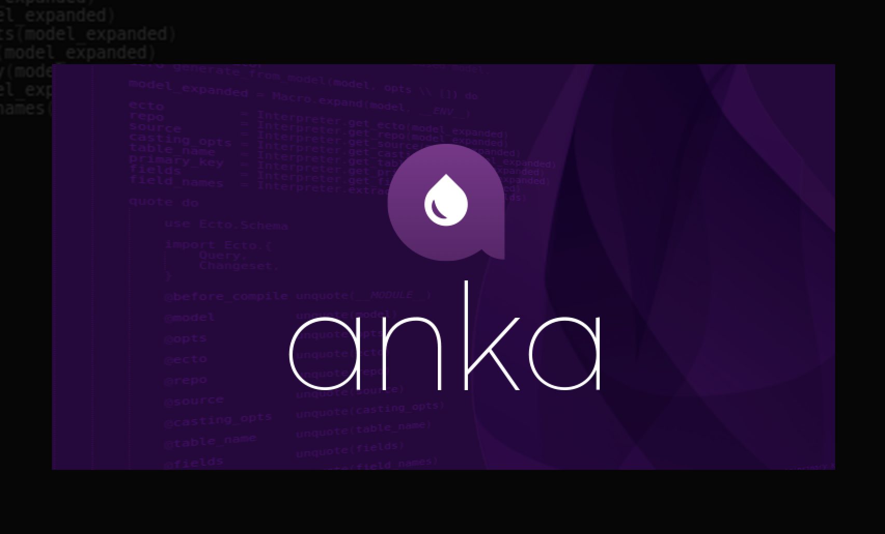

[`Anka`](https://github.com/elixir-anka/anka).`Ecto` helps to create Ecto schemas and their context functions with optionally definable pre/post processors
that prepare CRUDL resources from models based on Anka.Model.

[](https://hex.pm/packages/anka_ecto) [](https://hexdocs.pm/anka_ecto) [](https://hex.pm/packages/anka_ecto) [](https://github.com/elixir-anka_ecto/anka_ecto) [](LICENSE.txt)



---

</br>

**`Installation`**


The package is [available in Hex](https://hex.pm/packages/anka_ecto), it can be installed
by adding `:anka_ecto` to your list of dependencies in `mix.exs`:

```elixir
def application() do
	[
		extra_applications: [
			:anka,
			:anka_ecto,
		],
	]
end

def deps() do
	[
		{:anka, "~> 0.1.0"},
		{:anka_ecto, "~> 0.1.0"},
	]
end
```

</br>

**`Example`**


```elixir
defmodule Example.Models.User do

	use Anka.Model, [
		meta: [
			singular: :user,
			plural: :users,
		],
		ecto: [
			schema: [
				module: Example.Schemas.User,
			],
			repo: [
				module: Example.Repo,
			],
			source: [
				type: :schema,
				table_name: "users",
				primary_key: [
					type: :binary_id,
					name: :id,
					opts: [
						autogenerate: true,
					],
				],
				fields: [
					username: [
						binder: &Ecto.Schema.__field__/4,
						type: :string,
						name: :username,
						opts: [
							required: {true, [message: "can’t be blank", trim: true]},
							unique: true,
						],
					],
					password: [
						binder: &Ecto.Schema.__field__/4,
						type: :string,
						name: :password,
						opts: [
							virtual: true,
							required: &Example.ContextProcessors.UserContextProcessor.is_password_required?/2,
						],
					],
					password_hash: [
						binder: &Ecto.Schema.__field__/4,
						type: :string,
						name: :password_hash,
						opts: [],
					],
				],
				casting_opts: [],
				assocs: [
					posts: [
						binder: &Ecto.Schema.__has_many__/4,
						type: Example.Schemas.Post,
						name: :posts,
						opts: [],
					],
				],
				timestamps: [
					type: :utc_datetime,
					inserted_at: :inserted_at,
					updated_at: :updated_at,
				],
			],
			context: [
				functions: [
					create: [
						processors: [
							pre: [
								&Example.ContextProcessors.UserContextProcessor.pre_create/3,
							],
						],
					],
				],
			],
		],
	]

end


defmodule Example.Models.Post do

	use Anka.Model, [
		meta: [
			singular: :post,
			plural: :posts,
		],
		ecto: [
			schema: [
				module: Example.Schemas.Post,
			],
			repo: [
				module: Anka.Ecto.Repo,
			],
			source: [
				type: :schema,
				table_name: "posts",
				primary_key: [
					type: :binary_id,
					name: :id,
					opts: [
						autogenerate: true,
					],
				],
				fields: [
					user_id: [
						binder: nil,
						type: :binary_id,
						name: :user_id,
						opts: [
							required: true,
						],
					],
					title: [
						binder: &Ecto.Schema.__field__/4,
						type: :string,
						name: :title,
						opts: [
							required: true,
						],
					],
					body: [
						binder: &Ecto.Schema.__field__/4,
						type: :string,
						name: :body,
						opts: [
							required: true,
						],
					],
				],
				casting_opts: [],
				assocs: [
					user: [
						binder: &Ecto.Schema.__belongs_to__/4,
						type: Example.Schemas.User,
						name: :user,
						opts: [
							foreign_key: :user_id,
						],
					],
				],
				timestamps: [
					type: :utc_datetime,
					inserted_at: :inserted_at,
					updated_at: :updated_at,
				],
			],
		],
	]

end


defmodule Example.Schemas.User do

	use Anka.Ecto.Schema,
		model: Example.Models.User

	alias Example.Contexts.Users

	def put_password_hash(changeset) do
		case changeset do
			%Ecto.Changeset{
				valid?: true,
				changes: %{
					password: password,
				},
			} ->
				changeset
				|> put_change(:password_hash, Comeonin.Pbkdf2.hashpwsalt(password))
			_ ->
				changeset
		end
	end

	def check_password(username, password)
	when is_bitstring(username)
	do
		user = Users.get_user_by_username(username)
		__MODULE__.check_password(user, password)
	end

	def check_password(%__MODULE__{} = user, password) do
		case Comeonin.Pbkdf2.checkpw(password, user.password_hash) do
			true ->
				{true, user}
			false ->
				{false, nil}
		end
	end

	def check_password(nil = _user, _password) do
		{false, nil}
	end

end


defmodule Example.Schemas.Post do

	use Anka.Ecto.Schema,
		model: Example.Models.Post

end


defmodule Example.Contexts.Users do

	use Anka.Ecto.Context,
		model: Example.Models.User

	def get_user_by_username(username, opts \\ [])
	when is_bitstring(username)
	do
		__MODULE__.get_user_by([username: username], opts)
	end

end


defmodule Example.ContextProcessors.UserContextProcessor do

	alias Example.Schemas.User

	def is_password_required?(%User{} = user, %{} = _attrs) do
		is_nil(user.password_hash)
	end

	def is_password_required?(%Ecto.Changeset{} = changeset, %{} = attrs) do
		__MODULE__.is_password_required?(changeset.data, attrs)
	end

	def pre_create(%Ecto.Changeset{} = changeset, %{} = attrs, opts \\ []) do
		changeset = changeset
			|> User.put_password_hash()
		{:cont, {changeset, attrs, opts}}
	end

	def post_create(%User{} = user, %{} = attrs, opts \\ []) do
		{:cont, {user, attrs, opts}}
	end

end


defmodule Example.Contexts.Posts do

	use Anka.Ecto.Context,
		model: Example.Models.Post

end


iex(1)> Example.Contexts.Users.
change_user/1             change_user/2             change_user/3             
create_user!/0            create_user!/1            create_user!/2            
create_user/0             create_user/1             create_user/2             
delete_user!/1            delete_user!/2            delete_user/1             
delete_user/2             get_user!/1               get_user!/2               
get_user/1                get_user/2                get_user_by!/1            
get_user_by!/2            get_user_by/1             get_user_by/2             
get_user_by_username/1    get_user_by_username/2    list_users!/0             
list_users!/1             list_users/0              list_users/1              
update_user!/1            update_user!/2            update_user!/3            
update_user/1             update_user/2             update_user/3  

iex(1)> Example.Contexts.Posts.
change_post/1     change_post/2     change_post/3     create_post!/0    
create_post!/1    create_post!/2    create_post/0     create_post/1     
create_post/2     delete_post!/1    delete_post!/2    delete_post/1     
delete_post/2     get_post!/1       get_post!/2       get_post/1        
get_post/2        get_post_by!/1    get_post_by!/2    get_post_by/1     
get_post_by/2     list_posts!/0     list_posts!/1     list_posts/0      
list_posts/1      update_post!/1    update_post!/2    update_post!/3    
update_post/1     update_post/2     update_post/3     


# See /test/ folder.
```
